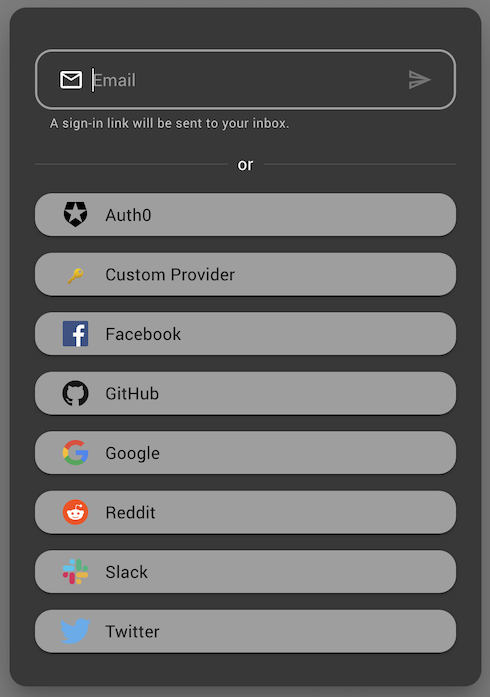

# next-auth-mui

Sign-in dialog for NextAuth built with MUI and React. Detects configured OAuth and Email providers and renders buttons or input fields for each respectively. Fully themeable, extensible and customizable to support custom credential flows.

[Storybook](https://timmikeladze.github.io/next-auth-mui/) - [Examples](https://github.com/TimMikeladze/next-auth-mui/blob/master/src/stories/NextAuthDialog.stories.tsx)



## Getting started

### Install

```console
npm install next-auth-mui

yarn add next-auth-mui
```
❗Note: [NextAuth](https://github.com/nextauthjs/next-auth) needs to be configured and [MUI](https://github.com/mui/material-ui) has to be installed in your project.


### Usage

Simply render the `<NextAuthDialog />` component in your app. This component will automatically detect the configured providers by sending a request to the `/api/auth/providers` endpoint and render the appropriate sign-in buttons or input fields.

```tsx
import React from 'react';
import { Button } from '@mui/material';
import NextAuthDialog from 'next-auth-mui';

const Example = () => {
  const [open, setOpen] = React.useState(false);
  return (
    <>
      <NextAuthDialog open={open} onClose={() => setOpen(false)} />

      <Button onClick={() => setOpen(true)}>
        Sign-in
      </Button>
    </>
  );
}
```

## Customization

Components rendered within the `next-auth-mui` dialog are customizable through passing the standard props supported by the respective `@mui/material` components.

If you need to implement custom logic for fetching providers or want complete control over the sign-in dialog, you can also import the `AuthDialog` component.


```tsx
import { AuthDialog } from 'next-auth-mui';
```

### Custom email authentication

A common use-case is using a 3rd party email authentication service to send magic links alongside NextAuth's OAuth providers. In this case you can implement a custom email submit handler.

In the example below we're using [magic.link](https://magic.link/) to send emails and a custom credentials provider to authenticate the user.

```tsx
<NextAuthDialog
  open
  {/* Render email field even if there is no email provider configured */}
  alwaysShowEmailField
  onSubmitEmail={async (email) => {
    // Send magic link
    const didToken = await magic.auth.loginWithMagicLink({ email });

    // sign in with NextAuth
    await signIn(`credentials`, {
      didToken,
      callbackUrl: router.query[`callbackUrl`]
    });
  }}
/>
```

## All options

```tsx
export type NextAuthDialogProps = AuthDialogProps & {
  /**
   * Disable sorting of providers by name when rendering their buttons.
   */
  disableSortByName?: boolean;
  /**
   * The endpoint of NextAuth server. Defaults to `/api/auth/providers`.
   */
  url?: string;
}

export type AuthDialogProps = PropsWithChildren<{
  /**
   * See @mui/material documentation
   */
  ButtonProps?: ButtonProps,
  /**
   * See @mui/material documentation
   */
  ButtonTypographyProps?: TypographyProps,
  /**
   * See @mui/material documentation
   */
  DialogContentProps?: DialogContentProps;
  /**
   * See @mui/material documentation
   */
  DialogContentTextProps?: DialogContentTextProps
  /**
   * See @mui/material documentation
   */
  DialogProps?: DialogProps;
  /**
   * See @mui/material documentation
   */
  DialogTitleProps?: DialogTitleProps;
  /**
   * Props passed to the email input field. See @mui/material documentation
   */
  EmailFieldProps?: TextFieldProps;
  /**
   * Props to pass to the default loading indicator. See @mui/material documentation
   */
  LinearProgressProps?: LinearProgressProps;
  /**
   * A custom loading indicator.
   */
  Progress?: React.ReactNode;
  /**
   * Always show the email field regardless if email provider has been configured.
   * This is useful for implementing email auth with a 3rd party api.
   */
  alwaysShowEmailField?: boolean;
  /**
   * Controls width of dialog.
   * When breakpoint >= viewport the dialog will be rendered in mobile mode.
   * Defaults to `xs`.
   */
  breakpoint?: Breakpoint,
  /**
   * Text to display between email field and oauth buttons. Defaults to "or".
   */
  dividerText?: string | React.ReactNode;
  /**
   * Render error text instead of providers
   */
  error?: string,
  /**
   * Hide the provider icons on their buttons.
   */
  hideProviderIcon?: boolean;
  /**
   * Hide the provider names on their buttons.
   */
  hideProviderName?: boolean;
  /**
   * Hide the dialog title. In mobile mode this will hide the close "x" icon.
   */
  hideTitle?: boolean;
  /**
   * Custom email validation function.
   */
  isValidEmail?: (email: string) => boolean;
  /**
   * If true a loading indicator will be displayed in the dialog.
   */
  loading?: boolean;
  /**
   * Callback for closing the dialog.
   */
  onClose?: () => void;
  /**
   * Callback runs on a failed sign in.
   */
  onOAuthSignInError?: (error: Error) => void;
  /**
   * Callback runs on a successful sign in.
   */
  onOAuthSignInSuccess?: (response: SignInResponse | undefined) => void;
  /**
   * Override default email submission function.
   * This is useful for implementing authentication with a 3rd party API like MagicLink.
   */
  onSubmitEmail?: (email: string) => Promise<void>;
  /**
   * When true the dialog will be open.
   */
  open: boolean,
  /**
   * An object mapping of provider id to provider config.
   */
  providers?: Record<string, ProviderConfig>;
  /**
   * Additional sign in options to be passed when calling `signIn`.  See next-auth for documentation
   */
  signInOptions?: SignInOptions;
  /**
   * Text to display in the dialog title. Empty by default.
   */
  titleText?: string | React.ReactNode;
}>

export type OauthProviderConfig = {
  /**
   * Override props passed to provider's button. See @mui/material documentation.
   */
  ButtonProps?: ButtonProps
  /**
   * Override props passed to provider's button's typography. See @mui/material documentation.
   */
  ButtonTypographyProps?: TypographyProps
  /**
   * Override props passed to provider's icon. See @iconify/react documentation.
   */
  IconProps?: IconProps;
  /**
   * Hide the provider icon on button.
   */
  hideProviderIcon?: boolean;
  /**
   * Hide the provider names button.
   */
  hideProviderName?: boolean;
  /**
   * Override the provider's icon. Can be a @iconify/react icon name or a custom component.
   */
  icon?: string | React.ReactNode;
  /**
   * Override the provider's name when rendering the button.
   */
  label?: string;
}

export type EmailProviderConfig = {
  /**
   * Override props passed to the email's input field. See @mui/material documentation.
   */
  EmailFieldProps?: TextFieldProps,
  /**
   * Override end icon rendered in the email input field
   */
  endIcon?: React.ReactNode;
  /**
   * Override text rendered below the email input field.
   */
  helperText?: string | React.ReactNode;
  /**
   * Override the placeholder text rendered in the email input field.
   */
  placeholder?: string;
  /**
   * Override start icon rendered in the email input field
   */
  startIcon?: React.ReactNode;
}

export type ProviderConfig = OauthProviderConfig & EmailProviderConfig & {
  /**
   * ID of the provider.
   */
  id: string;
  /**
   * Name of the provider. Will be used as the button's label and used when sorting providers.
   */
  name: string;
  /**
   * Override sign in options to be passed when calling `signIn`.  See next-auth for documentation
   */
  signInOptions?: SignInOptions;
  /**
   * Type of the provider.
   * Only `email` and `oauth` are supported, all other types will be ignored when rendering fields.
   */
  type: 'oauth' | 'email' | string;
};
```
