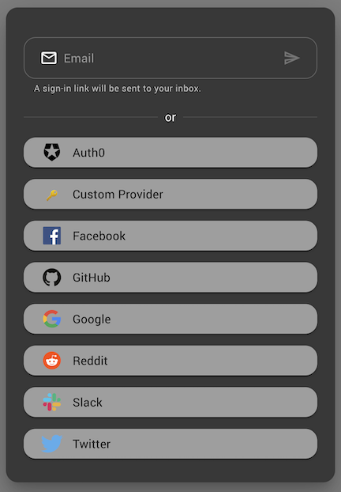

# next-auth-mui

Sign-in dialog for NextAuth built with MUI and React. Detects configured OAuth and Email providers and renders buttons or input fields for each respectively. Fully themeable, extensible and customizable to support custom credential flows.

[Storybook](https://timmikeladze.github.io/next-auth-mui/) - [Examples](https://github.com/TimMikeladze/next-auth-mui/blob/master/src/stories/NextAuthDialog.stories.tsx)



## Getting started

### Install

```console
npm install next-auth-mui

yarn add next-auth-mui
```
❗Note: [NextAuth](https://github.com/nextauthjs/next-auth) needs to be configured and [MUI](https://github.com/mui/material-ui) has to be installed in your project.


### Usage

Simply render the `<NextAuthDialog />` component in your app. This component will automatically detect the configured providers by sending a request to the `/api/auth/providers` endpoint and render the appropriate sign-in buttons or input fields.

```tsx
import React from 'react';
import { Button } from '@mui/material';
import NextAuthDialog from 'next-auth-mui';

const Example = () => {
  const [open, setOpen] = React.useState(false);
  return (
    <>
      <NextAuthDialog open={open} onClose={() => setOpen(false)} />

      <Button onClick={() => setOpen(true)}>
        Sign-in
      </Button>
    </>
  );
}
```

## Customization

Components rendered within the `next-auth-mui` dialog are customizable through passing the standard props supported by the respective `@mui/material` components.

If you need to implement custom logic for fetching providers or want complete control over the sign-in dialog, you can also import the `AuthDialog` component.

```tsx
import { AuthDialog } from 'next-auth-mui';
```

Below is a simple customization to change the way buttons appear globally, provide a custom label to the Google sign-in button and render a custom input field.

```tsx
<NextAuthDialog
  open
  ButtonProps={{
    color: 'secondary',
  }}
  providers={{
    google: {
      label: 'Sign-in with Google',
    },
  }}
>
  <TextField label="custom input" />
</NextAuthDialog>
```

## All options

```tsx
export type NextAuthDialogProps = AuthDialogProps & {
  /**
   * The endpoint of NextAuth server. Defaults to `/api/auth/providers`.
   */
  url?: string;
  /**
   * Disable sorting of providers by name when rendering their buttons.
   */
  disableSortByName?: boolean;
}

export type AuthDialogProps = PropsWithChildren<{
  /**
   * Controls width of dialog.
   * When breakpoint <= viewport the dialog will be rendered in mobile mode.
   * Defaults to `xs`.
   */
  breakpoint?: Breakpoint
  /**
   * When true the dialog will be open.
   */
  open: boolean
  /**
   * Callback for closing the dialog.
   */
  onClose?: () => void;
  /**
   * See @mui/material documentation
   */
  DialogContentTextProps?: DialogContentTextProps
  /**
   * See @mui/material documentation
   */
  DialogContentProps?: DialogContentProps;
  /**
   * See @mui/material documentation
   */
  DialogTitleProps?: DialogTitleProps;
  /**
   * See @mui/material documentation
   */
  DialogProps?: DialogProps;
  /**
   * See @mui/material documentation
   */
  ButtonProps?: ButtonProps
  /**
   * An object mapping of provider id to provider config.
   */
  providers?: Record<string, ProviderConfig>;
  /**
   * Hide the dialog title. In mobile mode this will hide the close "x" icon.
   */
  hideTitle?: boolean;
  /**
   * Text to display in the dialog title. Empty by default.
   */
  titleText?: string | React.ReactNode;
  /**
   * Text to display between email field and oauth buttons. Defaults to "or".
   */
  dividerText?: string | React.ReactNode;
  /**
   * If true a loading indicator will be displayed in the dialog.
   */
  loading?: boolean;
  /**
   * A custom loading indicator.
   */
  Progress?: React.ReactNode;
  /**
   * Props to pass to the default loading indicator. See @mui/material documentation
   */
  LinearProgressProps?: LinearProgressProps;
  /**
   * See @mui/material documentation
   */
  ButtonTypographyProps?: TypographyProps
  /**
   * Callback runs on a successful sign in.
   */
  onOAuthSignInSuccess?: (response: SignInResponse | undefined) => void;
  /**
   * Callback runs on a failed sign in.
   */
  onOAuthSignInError?: (error: Error) => void;
  /**
   * Props passed to the email input field. See @mui/material documentation
   */
  TextFieldProps?: TextFieldProps;
  /**
   * Custom email validation function.
   */
  isValidEmail?: (email: string) => boolean;
  /**
   * Override default email submission function.
   * This is useful for implementing authentication with a 3rd party API like MagicLink.
   */
  onSubmitEmail?: (email: string) => Promise<void>;
  /**
   * Additional sign in options to be passed when calling `signIn`.  See next-auth for documentation
   */
  signInOptions?: SignInOptions;
  /**
   * Hide the provider names on their buttons.
   */
  hideProviderName?: boolean;
  /**
   * Hide the provider icons on their buttons.
   */
  hideProviderIcon?: boolean;
}>

export type OauthProviderConfig = {
  /**
   * Override props passed to provider's button. See @mui/material documentation.
   */
  ButtonProps?: ButtonProps
  /**
   * Override props passed to provider's button's typography. See @mui/material documentation.
   */
  ButtonTypographyProps?: TypographyProps
  /**
   * Override the provider's name when rendering the button.
   */
  label?: string;
  /**
   * Hide the provider names button.
   */
  hideProviderName?: boolean;
  /**
   * Hide the provider icon on button.
   */
  hideProviderIcon?: boolean;
  /**
   * Override props passed to provider's icon. See @iconify/react documentation.
   */
  IconProps?: IconProps;
  /**
   * Override the provider's icon. Can be a @iconify/react icon name or a custom component.
   */
  icon?: string | React.ReactNode;
}

export type EmailProviderConfig = {
  /**
   * Override start icon rendered in the email input field
   */
  startIcon?: React.ReactNode;
  /**
   * Override end icon rendered in the email input field
   */
  endIcon?: React.ReactNode;
  /**
   * Override props passed to the email's input field. See @mui/material documentation.
   */
  TextFieldProps?: TextFieldProps
  /**
   * Override text rendered below the email input field.
   */
  helperText?: string | React.ReactNode;
  /**
   * Override the placeholder text rendered in the email input field.
   */
  placeholder?: string;
}

export type ProviderConfig = OauthProviderConfig & EmailProviderConfig & {
  /**
   * ID of the provider.
   */
  id: string;
  /**
   * Name of the provider. Will be used as the button's label and used when sorting providers.
   */
  name: string;
  /**
   * Type of the provider.
   * Only `email` and `oauth` are supported, all other types will be ignored when rendering fields.
   */
  type: 'oauth' | 'email' | string;
  /**
   * Override sign in options to be passed when calling `signIn`.  See next-auth for documentation
   */
  signInOptions?: SignInOptions;
};

```
